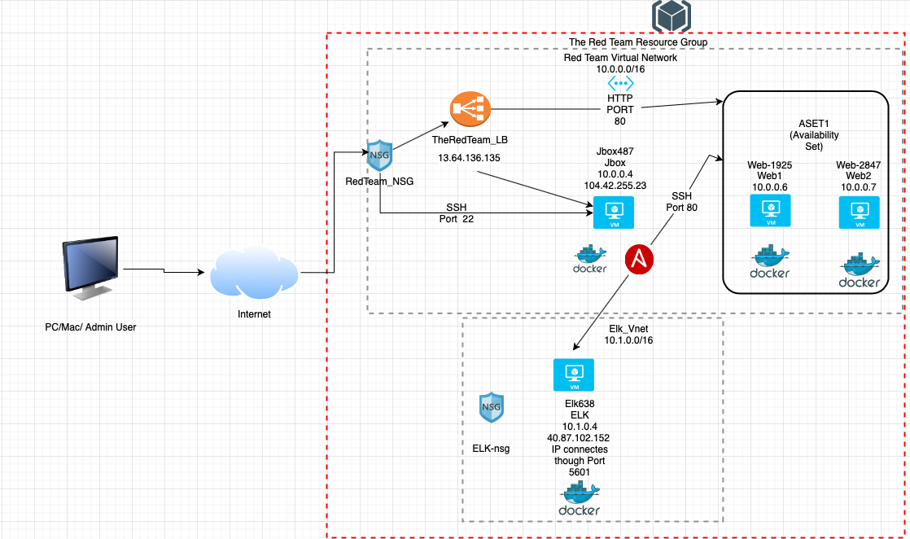
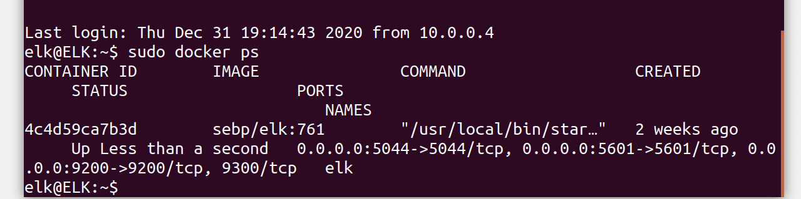
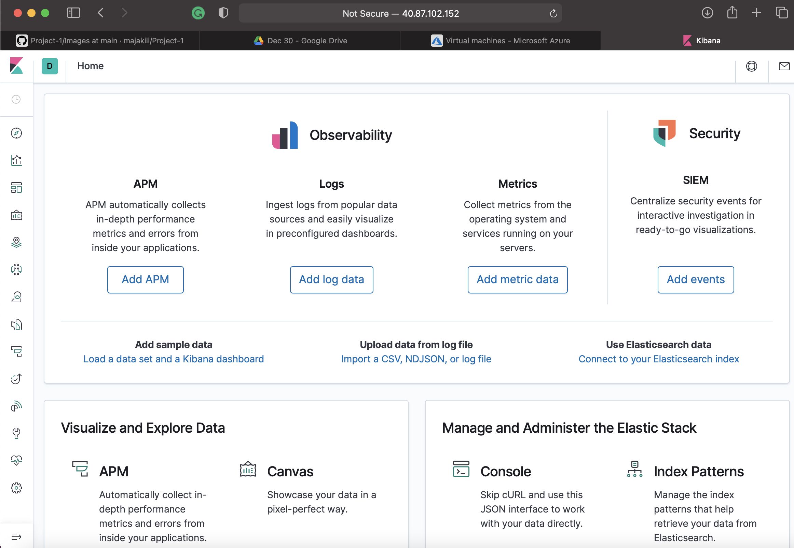
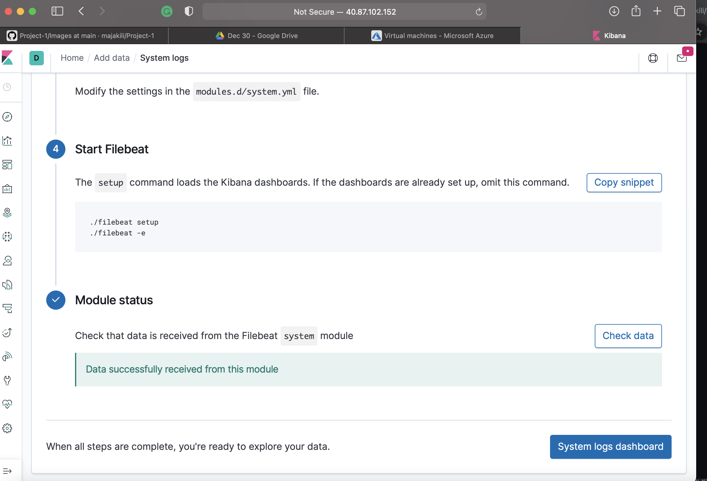

## Automated ELK Stack Deployment

The files in this repository were used to configure the network depicted below.



These files have been tested and used to generate a live ELK deployment on Azure. They can be used to either recreate the entire deployment pictured above. Alternatively, select portions of the .yml file may be used to install only certain pieces of it, such as Filebeat.

  - [DVWA](Ansible/dvwa.yml)
  - [ELK](Ansible/install-elk.yml)
    - [FILEBEAT](Ansible/filebeat-playbook.yml)
    - [METRICBEAT](Ansible/metricbeat-playbook.yml)

This document contains the following details:
- Description of the Topology
- Access Policies
- ELK Configuration
  - Beats in Use
  - Machines Being Monitored
- How to Use the Ansible Build


### Description of the Topology

The main purpose of this network is to expose a load-balanced and monitored instance of DVWA, the D*mn Vulnerable Web Application.

Load balancing ensures that the application will be highly reliable, in addition to restricting access to the network.

- The load balancers are used to protect from denial-of-service (DDos) attacks. The load balancer distributes traffic among the servers which also protects the availability aspect of security. -->

- The main advantage of jump box is to keep the virtual machines from public vulnerabilities

Integrating an ELK server allows users to easily monitor the vulnerable VMs for changes to the traffic and system logs.

- Filebeat, at the requests by admin, records log files and location.

- Metricbeat records metrics and statistics data from the operation system from services running on your server. 

The configuration details of each machine may be found below.
_Note: Use the [Markdown Table Generator](http://www.tablesgenerator.com/markdown_tables) to add/remove values from the table_.

| Name     | Function | IP Address | Operating System |
|----------|----------|------------|------------------|
| Jump Box | Gateway  | 10.0.0.4   | Linux            |
| Web-1    | Server   | 10.0.0.6   | Linux            |
| Web-2    | Server   | 10.0.0.7   | Linux            |  
| Elk      | Log/Monitor| 10.1.0.4 | Linux            |

### Access Policies
The machines on the internal network are not exposed to the public Internet. 

Only the Jump Box machine can accept connections from the Internet. Access to this machine is only allowed from the following IP addresses:

- 104.42.255.23

Machines within the network can only be accessed by the Jump Box.

- The Jump Box VM has access to the ELK VM. The IP address of the Jump Box VM is 10.0.0.4 and the Elk VM IP address is 10.1.0.4.

A summary of the access policies in place can be found in the table below.

| Name     | Publicly Accessible | Allowed IP Addresses |
|----------|---------------------|----------------------|
| Jump Box | Yes                 | 13.64.136.135 - LB   |
| Web-1    | No                  | 10.0.0.4             |
| Web-2    | No                  | 10.0.0.4             |
| Elk      | Yes                 | 13.64.136.135/10.0.0.4|

### Elk Configuration

Ansible was used to automate configuration of the ELK machine. No configuration was performed manually, which is advantageous because it allows administrator to automate some daily tasks and allows focus on more important tasks. 

The playbook implements the following tasks:
- Install docker.io
- Install Python pip3
- Install Docker Python Module
- Increase Virtual Machine memory
- Download and Launch the Docker ELK Container

The following screenshot displays the result of running `docker ps` after successfully configuring the ELK instance.



### Target Machines & Beats
This ELK server is configured to monitor the following machines:
- [Web-1] - 10.0.0.6
- [Web-2] - 10.0.0.7

We have installed the following Beats on these machines:
- Filebeat [filebeat-7.6.1-amd64.deb]
- Metricbeat [metricbeat-7.10.1-amd64.deb]

These Beats allow us to collect the following information from each machine:
- Filebeat collects the log events by visitors and transfers it to Logstash or Elasticsearch.
- Metricbeat collects the CPU and memory usage and transfers to the output at the specified location, Ekasticsearch or Logstash. 

### Using the Playbook
In order to use the playbook, you will need to have an Ansible control node already configured. Assuming you have such a control node provisioned: 

SSH into the control node and follow the steps below:
- Copy the [filebeat-config.yml](Ansible/filebeat-config.yml) file to /etc/ansible/files.

- Update the filebeat-config.yml file at the line 1105:
```
  - hosts: ["10.1.0.4:9200"]
  - username: "elastic"
  - password: "changeme"
```
- Also Line 1805 requires updating to following:
```
setup.kibana:
  host: "10.1.0.4:5601"
```

- Run the playbook, and navigate to `Kibana` through Elk VM public IP to check that the installation worked as expected. You should be able to see this page.


- First press the "Add log data" button
- Next "System log"
- Lastly click "Check data" button

In the case of succeful installation of `filebeat` you should be able to see the following.


 Also repeat the steps about for Installing Metricbeat starting with [metricbeat-config.yml](Ansible/metricbeat-config.yml)

Which file is the playbook? The playbook files are:

The playbook file always ends with .yml. As explained below:

- [playbook1.yml](Ansible/playbook1.yml) - Installs apache or webserver
- [dvwa.yml](Ansible/dvwa.yml) - Installs Docker and Python pip3 
- [install-elk.yml](Ansible/install-elk.yml) - Playbook to install Elk container
  - [filebeat-playbook.yml](Ansible/filebeat-playbook.yml) - Playbook to install Filebeat
  - [metricbeat-playbook.yml](Ansible/metricbeat-playbook.yml) - Playbook to install Metricbeat

Where do you copy it?

/etc/ansible/

Which file do you update to make Ansible run the playbook on a specific machine?

[/etc.ansible.cfg](Ansible/ansible.cfg)
[/etc/ansible/hosts](Ansible/hosts)

How do I specify which machine to install the ELK server on versus which to install Filebeat on?
```
[webservers]

10.0.0.7 ansible_python_interpreter=/usr/bin/python3
10.0.0.6 ansible_python_interpreter=/usr/bin/python3

[elk]
10.1.0.4 ansible_python_interpreter=/usr/bin/python3
```
Which URL do you navigate to in order to check that the ELK server is running?
```
http://publicip(elkserver):5601[http://40.87.102.152:5601]
```

### References

- Filebeat: Lightweight Log Analysis & Elasticsearch from https://www.elastic.co/beats/filebeat 
- Metricbeat: Lightweight Shipper for Metrics https://www.elastic.co/beats/metricbeat